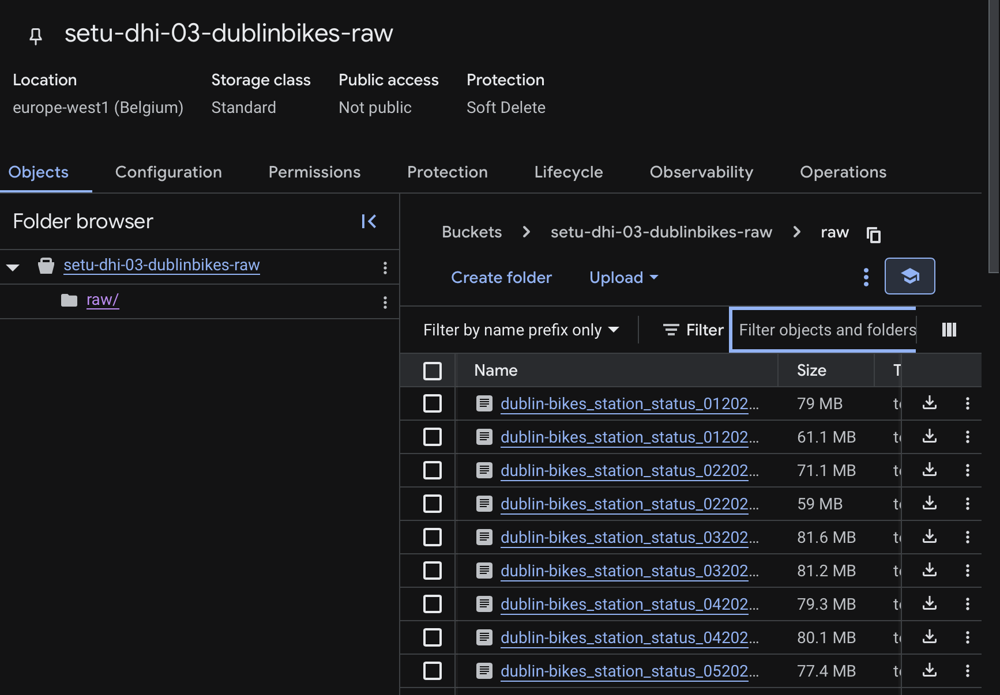
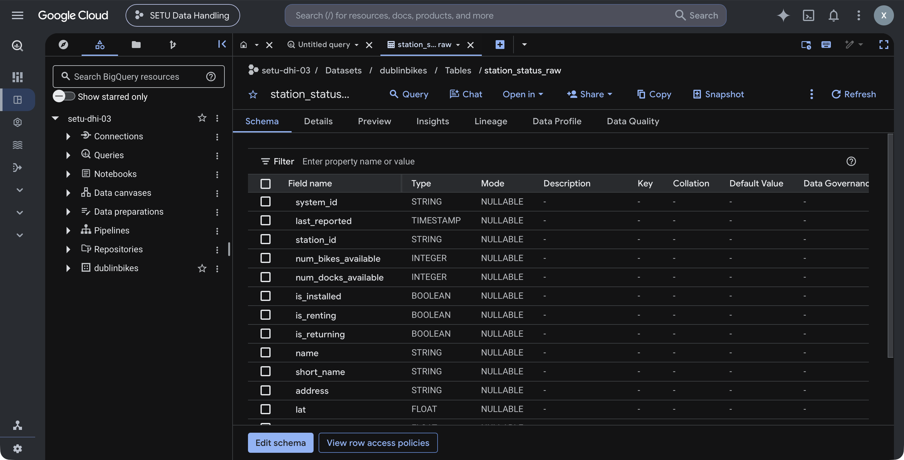
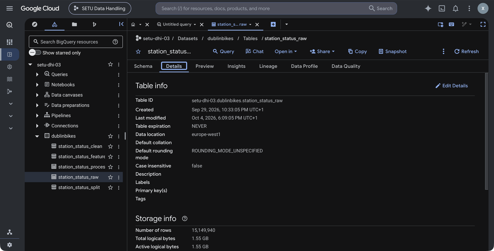
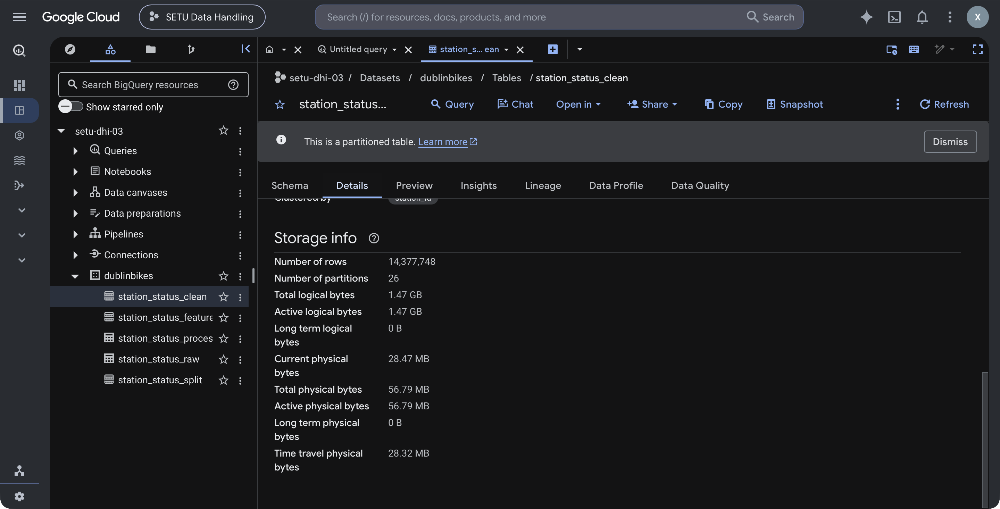
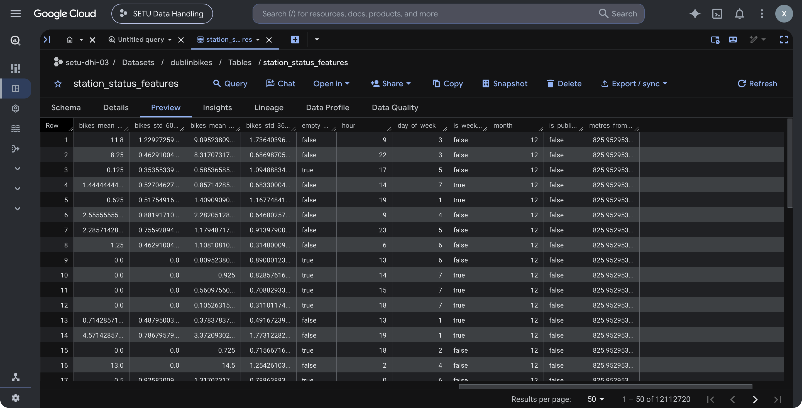
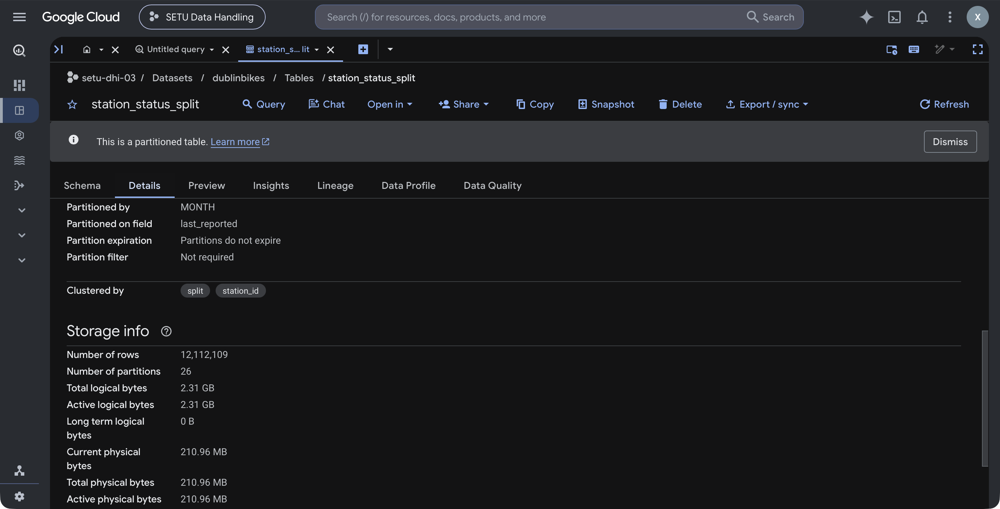
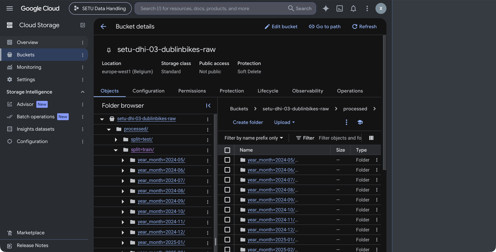
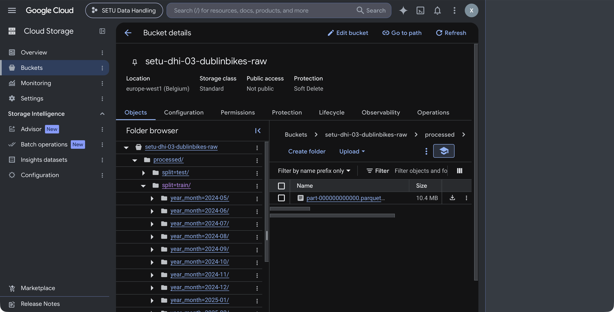

# Milestone 1

## 01 — Download

**Code**: [`src/01-a-download.py`](src/01-a-download.py)

**Purpose**: pull the historical [Dublin Bikes station CSVs](https://data.gov.ie/dataset/dublinbikes-api) from data.gov.ie.

**What it does**:
- Queries the catalogue for dublinbikes-api.
- Filters the resource list to files matching `dublinbike-historical-data-*` and
  `dublin-bikes_station_status_*`.
- Downloads each file to `datasets/raw/` 

**Output**: raw CSVs downloaded to `datasets/raw/` (gitignored). Re-running is idempotent.

```sh
$ ./src/01-a-download.py
download  dublinbike-historical-data-2021-10.csv
download  dublinbike-historical-data-2021-11.csv
download  dublinbike-historical-data-2021-12.csv
download  dublinbike-historical-data-2022-01.csv
download  dublinbike-historical-data-2022-02.csv
download  dublinbike-historical-data-2022-03.csv
download  dublinbike-historical-data-2022-04.csv
download  dublinbike-historical-data-2022-05.csv
download  dublinbike-historical-data-2022-06.csv
download  dublinbike-historical-data-2022-07.csv
download  dublinbike-historical-data-2022-08.csv
download  dublinbike-historical-data-2022-09.csv
download  dublinbike-historical-data-2022-10.csv
download  dublinbike-historical-data-2022-11.csv
download  dublinbike-historical-data-2022-12.csv
download  dublinbike-historical-data-2023-01.csv
download  dublinbike-historical-data-2023-02.csv
download  dublinbike-historical-data-2023-03.csv
download  dublinbike-historical-data-2023-04.csv
download  dublinbike-historical-data-2023-05.csv
download  dublinbike-historical-data-2023-06.csv
download  dublinbike-historical-data-2023-07.csv
download  dublinbike-historical-data-2023-08.csv
download  dublinbike-historical-data-2023-09.csv
download  dublinbike-historical-data-2023-10.csv
download  dublinbike-historical-data-2023-11.csv
download  dublinbike-historical-data-2023-12.csv
download  dublinbike-historical-data-2024-01.csv
download  dublinbike-historical-data-2024-02.csv
download  dublin-bikes_station_status_052024.csv
download  dublin-bikes_station_status_062024.csv
download  dublin-bikes_station_status_072024.csv
download  dublin-bikes_station_status_082024.csv
download  dublin-bikes_station_status_092024.csv
download  dublin-bikes_station_status_102024.csv
download  dublin-bikes_station_status_112024.csv
download  dublin-bikes_station_status_122024.csv
download  dublin-bikes_station_status_012025.csv
download  dublin-bikes_station_status_022025.csv
download  dublin-bikes_station_status_032025.csv
download  dublin-bikes_station_status_042025.csv
download  dublin-bikes_station_status_052025.csv
download  dublin-bikes_station_status_062025.csv
download  dublin-bikes_station_status_072025.csv
download  dublin-bikes_station_status_082025.csv
download  dublin-bikes_station_status_092025.csv
download  dublin-bikes_station_status_102025.csv
download  dublin-bikes_station_status_112025.csv
download  dublin-bikes_station_status_122025.csv
download  dublin-bikes_station_status_012026.csv
download  dublin-bikes_station_status_022026.csv
download  dublin-bikes_station_status_032026.csv
download  dublin-bikes_station_status_042026.csv
download  dublin-bikes_station_status_052026.csv
download  dublin-bikes_station_status_062026.csv
```

## Verify raw files

**Code**: [`src/01-b-verify.py`](src/01-b-verify.py)

`datasets/raw.sha256` contains a record of the SHA256 of each downloaded file. It is in the standard `shasum` format.

This python script executes the shasum executable which verifies the hashes of each file match.

```sh
$ ./src/01-b-verify.py
dublin-bikes_station_status_012025.csv: OK
dublin-bikes_station_status_012026.csv: OK
dublin-bikes_station_status_022025.csv: OK
dublin-bikes_station_status_022026.csv: OK
dublin-bikes_station_status_032025.csv: OK
dublin-bikes_station_status_032026.csv: OK
dublin-bikes_station_status_042025.csv: OK
dublin-bikes_station_status_042026.csv: OK
dublin-bikes_station_status_052024.csv: OK
dublin-bikes_station_status_052025.csv: OK
dublin-bikes_station_status_052026.csv: OK
dublin-bikes_station_status_062024.csv: OK
dublin-bikes_station_status_062025.csv: OK
dublin-bikes_station_status_062026.csv: OK
dublin-bikes_station_status_072024.csv: OK
dublin-bikes_station_status_072025.csv: OK
dublin-bikes_station_status_082024.csv: OK
dublin-bikes_station_status_082025.csv: OK
dublin-bikes_station_status_092024.csv: OK
dublin-bikes_station_status_092025.csv: OK
dublin-bikes_station_status_102024.csv: OK
dublin-bikes_station_status_102025.csv: OK
dublin-bikes_station_status_112024.csv: OK
dublin-bikes_station_status_112025.csv: OK
dublin-bikes_station_status_122024.csv: OK
dublin-bikes_station_status_122025.csv: OK
dublinbike-historical-data-2021-10.csv: OK
dublinbike-historical-data-2021-11.csv: OK
dublinbike-historical-data-2021-12.csv: OK
dublinbike-historical-data-2022-01.csv: OK
dublinbike-historical-data-2022-02.csv: OK
dublinbike-historical-data-2022-03.csv: OK
dublinbike-historical-data-2022-04.csv: OK
dublinbike-historical-data-2022-05.csv: OK
dublinbike-historical-data-2022-06.csv: OK
dublinbike-historical-data-2022-07.csv: OK
dublinbike-historical-data-2022-08.csv: OK
dublinbike-historical-data-2022-09.csv: OK
dublinbike-historical-data-2022-10.csv: OK
dublinbike-historical-data-2022-11.csv: OK
dublinbike-historical-data-2022-12.csv: OK
dublinbike-historical-data-2023-01.csv: OK
dublinbike-historical-data-2023-02.csv: OK
dublinbike-historical-data-2023-03.csv: OK
dublinbike-historical-data-2023-04.csv: OK
dublinbike-historical-data-2023-05.csv: OK
dublinbike-historical-data-2023-06.csv: OK
dublinbike-historical-data-2023-07.csv: OK
dublinbike-historical-data-2023-08.csv: OK
dublinbike-historical-data-2023-09.csv: OK
dublinbike-historical-data-2023-10.csv: OK
dublinbike-historical-data-2023-11.csv: OK
dublinbike-historical-data-2023-12.csv: OK
dublinbike-historical-data-2024-01.csv: OK
dublinbike-historical-data-2024-02.csv: OK
```

## 02 — Storage

**Code**: [`src/02-a-upload.py`](src/02-a-upload.py), [`src/02-b-load-bigquery.py`](src/02-b-load-bigquery.py), [`src/02-c-profile.py`](src/02-c-profile.py)

First export your Google Cloud credentials. Every script that talks to BigQuery (02-b, 02-c and 03 to 07) reads this variable.

```sh
export GOOGLE_APPLICATION_CREDENTIALS=~/.config/setu-gcp/setu-dhi-03-admin.json
```

The upload script (02-a), and 07-store.py when it clears old files, use the `gcloud` command line tool, which needs a separate sign-in:

```sh
gcloud auth activate-service-account --key-file="$GOOGLE_APPLICATION_CREDENTIALS"
gcloud config set project setu-dhi-03
```

Then create the bucket
```sh
gcloud storage buckets create gs://setu-dhi-03-dublinbikes-raw --project=setu-dhi-03 
```

Then execute `src/02-a-upload.py` to upload the csvs. It runs `gcloud storage rsync --checksums-only`, which compares
file contents and copies only new or changed files, so re-running it is safe. The first upload of all 55 files took about 7 minutes.

```sh
./src/02-a-upload.py
```



Load the station status CSVs from the bucket into a Google BigQuery table. This loads 15,149,940 rows.
```sh
$ ./src/02-b-load-bigquery.py
2026-09-29 22:32:46,877 INFO loading gs://setu-dhi-03-dublinbikes-raw/raw/dublin-bikes_station_status_*.csv into setu-dhi-03.dublinbikes.station_status_raw
2026-09-29 22:33:21,484 INFO loaded 15,149,940 rows into setu-dhi-03.dublinbikes.station_status_raw
```

The resulting table in the Google Cloud console:





Profile the raw table for data quality, this checks for missing values, negative counts,
missing months, missing days and gaps in each station's readings, and measures how far bikes + docks is from capacity.
```sh
$ ./src/02-c-profile.py
2026-10-04 19:12:13,762 INFO learning samples 15,149,940 vs minimum 10,000: OK
2026-10-04 19:12:14,260 INFO null_values: {'null_ts': 0, 'null_station': 0, 'null_bikes': 0, 'null_docks': 0, 'null_capacity': 0}
2026-10-04 19:12:14,683 INFO negative_counts: {'negative_bikes': 0, 'negative_docks': 0}
2026-10-04 19:12:15,180 INFO bikes_plus_docks_vs_capacity: {'mismatch_any': 764973, 'mismatch_over_10': 143388, 'bikes_and_docks_both_zero': 89355}
2026-10-04 19:12:16,105 INFO missing_months: {'missing_months': 0, 'which': None}
2026-10-04 19:12:16,540 INFO missing_days: {'missing_days': 39, 'which': '2024-09-04,2024-09-05,2024-09-06,2024-09-07,2024-09-08,2024-09-09,2024-09-10,2024-09-11,2024-09-12,2024-09-13,2024-09-14,2024-09-15,2024-09-16,2024-09-17,2024-09-18,2024-09-19,2024-09-20,2024-09-21,2024-09-22,2024-09-23,2024-09-24,2024-09-25,2024-09-26,2024-09-27,2024-09-28,2024-09-29,2024-09-30,2025-07-06,2026-01-25,2026-01-26,2026-01-27,2026-01-28,2026-01-29,2026-01-30,2026-01-31,2026-02-01,2026-02-02,2026-02-03,2026-02-04'}
2026-10-04 19:12:16,963 INFO station_sampling_gaps: {'gaps_over_15_min': 7230, 'longest_gap_minutes': 212180, 'median_gap_minutes': 10}
```

The missing-days check lists every day between the first and last reading (UTC) with no readings at all. It finds
39 days that the missing-months check cannot see, because each of those months still has some readings:

| Missing days | Count | Split it falls in |
|---|---|---|
| 2024-09-04 to 2024-09-30 | 27 | Train |
| 2025-07-06 | 1 | Train |
| 2026-01-25 to 2026-02-04 | 11 | Validate |

These gaps are in the raw source files.

## 03 — Filtering

**Code**: [`src/03-filter.py`](src/03-filter.py)

I want to filter and remove invalid data. Invalid data consists of:
- Capacity mismatch: rows where bikes + docks differs from capacity.
- Station status: rows where is_installed, is_renting or is_returning is false.
- Duplicates: repeated (station, timestamp) rows.

`src/03-filter.py` counts the rows failing each rule, writes up to three example rows for each rule that finds any to
`logs/03-filter.failures.jsonl`, then builds `setu-dhi-03.dublinbikes.station_status_clean`
from the raw table. The clean table is partitioned by month and clustered by station.
After building, the script re-runs the same rule counts on the clean table and fails if
any rule still finds a row, or if the clean row count differs from the expected count.

| Rule | Rows dropped | Share of raw rows |
|---|---|---|
| Capacity mismatch | 764,973 | 5.05% |
| Station status | 17,100 | 0.11% |
| Duplicates | 0 | 0% |
| Fail more than one rule (counted once) | 9,881 | |
| **Total dropped** | **772,192** | **5.10%** |
| **Rows kept** | **14,377,748** | |

```sh
$ ./src/03-filter.py
2026-10-04 17:40:26,446 INFO raw: {'rows_in': '15,149,940', 'capacity_fails': '764,973', 'status_fails': '17,100', 'duplicate_fails': '0', 'fails_more_than_one_rule': '9,881', 'rows_kept': '14,377,748'}
2026-10-04 17:40:26,447 INFO dropping 772,192 of 15,149,940 rows (5.10%)
2026-10-04 17:40:29,113 INFO building `setu-dhi-03.dublinbikes.station_status_clean`
2026-10-04 17:40:35,950 INFO clean: {'rows_in': '14,377,748', 'capacity_fails': '0', 'status_fails': '0', 'duplicate_fails': '0', 'fails_more_than_one_rule': '0', 'rows_kept': '14,377,748'}
2026-10-04 17:40:35,951 INFO check passed: 14,377,748 rows in `setu-dhi-03.dublinbikes.station_status_clean`, no rule failures
```

The clean table in the console: 14,377,748 rows in 26 monthly partitions, clustered by `station_id`:



## 04 — Feature extraction

**Code**: [`src/04-features.py`](src/04-features.py)

The model predicts, for each station, the number of bikes available 30 minutes ahead and whether
the station will be empty then. `src/04-features.py` builds a new BigQuery table called `setu-dhi-03.dublinbikes.station_status_features`
from the clean table: one row per station per reading, partitioned by month and clustered by station.

| Group | Columns | How |
|---|---|---|
| Targets | `bikes_t_plus_30`, `empty_t_plus_30` | The reading exactly 30 minutes later. Rows with no such reading are dropped |
| Current | `num_bikes_available`, `num_docks_available` | The reading itself |
| Rolling | `bikes_mean_60min`, `bikes_std_60min`, `bikes_mean_360min`, `bikes_std_360min` | Mean and standard deviation over the last 1 and 6 hours, by time rather than by row count |
| Calendar | `hour`, `day_of_week` (1 = Sunday), `is_weekend`, `month`, `is_public_holiday` | Irish local time (Europe/Dublin); holidays from the `holidays` Python package |
| Station | `capacity`, `lat`, `lon`, `metres_from_centre` | Distance from O'Connell Bridge |

Only the targets look ahead in time; every other column uses the current or earlier readings.

| | Rows |
|---|---|
| Clean rows in | 14,377,748 |
| Dropped: no reading 30 minutes later | 2,265,028 |
| **Feature rows out** | **12,112,720** |
| Target "station empty" | 1,236,355 (10.21%) |


```sh
$ ./src/04-features.py
2026-10-04 18:42:50,808 INFO building `setu-dhi-03.dublinbikes.station_status_features` from 14,377,748 rows in `setu-dhi-03.dublinbikes.station_status_clean`
2026-10-04 18:43:06,595 INFO rows out 12,112,720; dropped 2,265,028 with no reading at t+30 min
2026-10-04 18:43:06,595 INFO empty at t+30 min: 1,236,355 (10.21%)
2026-10-04 18:43:06,597 INFO done
```

A preview of the feature table in the console



## 05 — Train/dev/test splits

**Code**: [`src/05-splits.py`](src/05-splits.py)

The split is by date. The model predicts the future, so it is trained on earlier data and tested on
later data. A random split would put readings from the same hour in both train and test, and the test score
would look better than it would be in real use. `src/05-splits.py` builds `setu-dhi-03.dublinbikes.station_status_split`:
the feature table plus a `split` column, partitioned by month and clustered by split and station.

Boundaries are midnight:

| Split | Dates | Rows | Share | Stations | Station empty at t+30 |
|---|---|---|---|---|---|
| Train | 2024-05-02 to 2025-12-31 | 9,330,011 | 77.03% | 115 | 10.39% |
| Validate | 2026-01-01 to 2026-03-31 | 1,260,240 | 10.40% | 114 | 8.96% |
| Test | 2026-04-01 to 2026-06-30 | 1,521,858 | 12.56% | 114 | 10.11% |


The validation period is missing 11 days of readings (25 January to 4 February 2026).


```sh
$ ./src/05-splits.py
2026-10-04 18:51:52,232 INFO building `setu-dhi-03.dublinbikes.station_status_split` from 12,112,720 rows in `setu-dhi-03.dublinbikes.station_status_features`
2026-10-04 18:51:59,144 INFO rows out 12,112,109; dropped 611 whose target crosses a split boundary
2026-10-04 18:51:59,144 INFO train    9,330,011 rows (77.03%), 2024-05-02 19:00:00+00:00 to 2025-12-31 23:25:00+00:00, 115 stations, empty at t+30 min 10.39%
2026-10-04 18:51:59,144 INFO validate 1,260,240 rows (10.40%), 2026-01-01 00:05:00+00:00 to 2026-03-31 23:25:00+00:00, 114 stations, empty at t+30 min 8.96%
2026-10-04 18:51:59,145 INFO test     1,521,858 rows (12.56%), 2026-04-01 00:05:00+00:00 to 2026-06-30 23:25:00+00:00, 114 stations, empty at t+30 min 10.11%
2026-10-04 18:51:59,145 INFO check passed: three splits, no overlapping dates, no target past its split's end
```

The split table in the console, partitioned by month and clustered by `split` and `station_id`:




## 06 — Sharding

**Code**: [`src/06-shard.py`](src/06-shard.py)

The split table is divided into shards of one split and one calendar month each: 26 shards (train 20, validate 3,
test 3). Month is the shard key because the split boundaries fall on month starts, so no shard spans two splits.


```sh
$ ./src/06-shard.py
2026-10-04 18:56:48,028 INFO 26 shards from 12,112,109 rows in setu-dhi-03.dublinbikes.station_status_split
2026-10-04 18:56:48,029 INFO   train    20 shards
2026-10-04 18:56:48,029 INFO   validate 3 shards
2026-10-04 18:56:48,029 INFO   test     3 shards
2026-10-04 18:56:48,029 INFO smallest train/2024-09 41,802 rows; largest test/2026-05 522,733 rows
```

The shards in the bucket, as one folder per month



The September 2024 shard is small because the source file only covers 1 to 3 September 2024

## 07 — Store preprocessed data

**Code**: [`src/07-store.py`](src/07-store.py)

Each shard is exported from BigQuery as Parquet files to the project bucket:

```
gs://setu-dhi-03-dublinbikes-raw/processed/split=<train|validate|test>/year_month=<YYYY-MM>/part-*.parquet
```

- Parquet keeps the column types and all files are compressed: 26 files (one per shard)
- Each shard is sorted by station and time before it is written.
- Each shard's folder is emptied before its export. 
- After exporting, the script creates the external table `setu-dhi-03.dublinbikes.station_status_processed` over the
Parquet files and checks that its row count per split equals the split table.

```sh
$ ./src/07-store.py
2026-10-04 19:17:34,533 INFO 1/26 shards done (train/2024-05, 465,536 rows)
...
2026-10-04 19:20:45,756 INFO 26/26 shards done (test/2026-06, 493,091 rows)
2026-10-04 19:20:49,112 INFO   train    stored 9,330,011 rows, split table 9,330,011
2026-10-04 19:20:49,112 INFO   validate stored 1,260,240 rows, split table 1,260,240
2026-10-04 19:20:49,112 INFO   test     stored 1,521,858 rows, split table 1,521,858
2026-10-04 19:20:49,112 INFO check passed: Parquet files in gs://setu-dhi-03-dublinbikes-raw/processed match `setu-dhi-03.dublinbikes.station_status_split`
```

One shard in the console 



